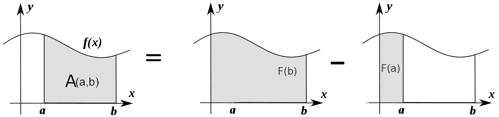

.. _calculus:

========
微积分
========

.. contents:: :local:

.. _introduction:

简介
============

你需要知道一下基本的微积分来理解函数是如何随时间改变的(导数), 并且计算随着时间累计的总量(积分)。微积分的语言可以让你更准确的描述函数的属性，更好的理解他们的行为。

通常上微积分课程需要进行很多的乏味的手工计算，但是我们的电脑可以让这个过程变得很有趣。这一节描述微积分的关键思路，这是你理解机器学习的必需掌握的。

.. _derivative:

导数
===========
导数可以用两种方式来定义:

 #. 某瞬间的变化率(物理)
 #. 一条线上的某点的斜率(几何)

他们都表示了相同的原理， 但是用几何的定义解释会容易一些。

几何定义
--------------------

几何斜率代表一条线的陡峭程度。它回答了一个问题: 给定某个 :math:`x` 的变化， :math:`y` 或 :math:`f(x)` 会产生多大变化。

.. image:: images/slope_formula.png
    :align: center

使用这个定义我们可以很容易的计算2点之间的斜率。但是如果我问你，不是计算2点之间的斜率，而是计算线上一个点的斜率呢？这种情况下就没那么简单的计算了。导数可以帮助我们回答这个问题。

导数输出一个表达式我们可以用来计算 *某瞬间的变化率* 或一条线上某点的斜率。解出导数你就可以计算线上其他点的斜率。

求导
---------------------

如下图所示, 函数 :math:`f(x) = x^2 + 3`.

.. image:: images/calculus_slope_intro.png
    :align: center

(1,4) 和 (3,12) 2点间的斜率是:

.. math::

  slope = \frac{y2-y1}{x2-x1} = \frac{12-4}{3-1} = 4

但是如何计算点(1,4)的斜率？

一种方法是找2个最近的点，技术它们相对 :math:`x` 的斜率然后求平均。但是微积分提供了一张更简单更准确的方法:计算导数。计算函数的导数和我们原来的提议是一样的，
但是我们不找2个最近的点，而是想象一个距离 :math:`x` 无穷近的点然后计算 :math:`x` 和这个点之间的斜率。

这样的话，导数帮助我们回答这个问题: 如果我们把x很小很小地增加一点，:math:`f(x)` 会变化多少?
换句话说，导数帮助 *估计* 2个无穷距离小的点之间的斜率。很小很小的距离，但是足以计算斜率就行。

在数学语言里我们用极限表示无穷小的增长。极限的定义是，当输入趋近于一个值时，函数的输出趋近的值。在我们的例子里，目标值就是某个点的斜率。

步骤
------------

计算导数和计算普通斜率一样，只是我们计算一个点和距离它无穷小的点的斜率。我们使用变量 :math:`h` 来表示这个无穷小的距离。这个是我们的步骤:

1. 给定一个函数:

.. math::

  f(x) = x^2

2. 增加 :math:`x` 一个很小的值 :math:`h (h = Δx)`

.. math::

  f(x + h) = (x + h)^2

3. 使用斜率公式

.. math::

  \frac{f(x + h) - f(x)}{h}

4. 简化这个等式

.. math::

  \frac{x^2 + 2xh + h^2 - x^2}{h} \\

  \frac{2xh+h^2}{h} = 2x+h

5. 把 :math:`h` 设为 0 (极限是 :math:`h` 趋近 0)

.. math::

  {2x + 0} = {2x}

这意味着什么？这意味着对于函数 :math:`f(x) = x^2` , 任意点的斜率等于 :math:`2x` 。公式定义为:

.. math::

  \lim_{h\to0}\frac{f(x+h) - f(x)}{h}

.. rubric:: Code

让我们写代码来计算任意函数 :math:`f(x)` 的导数。我们可以通过测试输入 :math:`f(x)=x^2` 会产生导数 :math:`2x` 来验证我们的函数正常工作。

::

  def get_derivative(func, x):
      """Compute the derivative of `func` at the location `x`."""
      h = 0.0001                          # step size
      return (func(x+h) - func(x)) / h    # rise-over-run

  def f(x): return x**2                   # some test function f(x)=x^2
  x = 3                                   # the location of interest
  computed = get_derivative(f, x)
  actual = 2*x

  computed, actual   # = 6.0001, 6        # pretty close if you ask me...

通常我们希望使用数学来获得准确的导数公式，但是记住你永远可以通过计算一个很小的 :math:`h` 来计算导数值。

机器学习用例
--------------------------

机器学习使用导数进行问题优化。优化算法如 *梯度下降* 使用导数来决定是否增加或减少权重来最大化或最小化一下目标值(如. 模型的准确率或错误函数)。
导数还能帮助我们把非线性函数近似为线性函数(切线), 线性函数的斜率是一个常数。有了常数斜率我们可以决定上升还是下假斜率（增加和减少权重）来接近目标值(分类标签)。

.. _chain_rule:

链式法则
==========

链式法则是一个计算组合函数的导数的公式。组合函数是在内部组合其他函数的函数。

如何工作的
------------

跟定一个组合函数 :math:`f(x) = A(B(x))`, :math:`f(x)` 的导数等于 :math:`A` 相对 :math:`B(x)` 的导数乘以 :math:`B` 相对 :math:`x` 的导数。

.. math::

  \mbox{组合函数导数} = \mbox{外部函数导数} * \mbox{内部函数导数}

例如，给定组合函数 :math:`f(x)`, 当

.. math::

  f(x) = h(g(x))

链式法则告诉我们 :math:`f(x)` 的导数等于:

.. math::

  \frac{df}{dx} = \frac{dh}{dg} \cdot \frac{dg}{dx}

详细步骤
------------

假设 :math:`f(x)` 是 :math:`h(x) = x^3` 和 :math:`g(x) = x^2` 2个函数的组合。那么

.. math::

  \begin{align}
  f(x) &= h(g(x)) \\
       &= (x^2)^3 \\
  \end{align}

:math:`f(x)` 的导数等于:

.. math::

  \begin{align}
  \frac{df}{dx} &=  \frac{dh}{dg} \frac{dg}{dx} \\
                &=  \frac{dh}{d(x^2)} \frac{dg}{dx}
  \end{align}

.. rubric:: 步骤

1. 算出内部导数 :math:`g(x) = x^2`

.. math::

  \frac{dg}{dx} = 2x

2. 算出外部导数 :math:`h(x) = x^3`, 使用占位符 :math:`b` 表示内部函数 :math:`x^2`

.. math::

  \frac{dh}{db} = 3b^2

3. 用内部函数替换占位符

.. math::

  3x^4

4. 返回2个导数乘积

.. math::

  3x^4 \cdot 2x = 6x^5

多函数
------------------

在上面的例子，我们假设组合函数包含一个内部函数，但是链式法则可以应用在这样的高阶函数:

.. math::

  f(x) = A(B(C(x)))

链式法则告诉我们函数导数等于:

.. math::

  \frac{df}{dx} = \frac{dA}{dB} \frac{dB}{dC} \frac{dC}{dx}

我们还能等式写成 :math:`f'` 符号:

.. math::

  f' = A'(B(C(x)) \cdot B'(C(x)) \cdot C'(x)

.. rubric:: 步骤

给定函数 :math:`f(x) = A(B(C(x)))`, 假设:

.. math::

  \begin{align}
  A(x) & = sin(x) \\
  B(x) & = x^2 \\
  C(x) & = 4x
  \end{align}

这些函数的导数为:

.. math::

  \begin{align}
  A'(x) &= cos(x) \\
  B'(x) &= 2x \\
  C'(x) &= 4
  \end{align}

我们可以用下面的公式计算 :math:`f(x)` 的导数:

.. math::

  f'(x) = A'( (4x)^2) \cdot B'(4x) \cdot C'(x)

然后写入导数来简化表达式:

.. math::

  \begin{align}
  f'(x) &= cos((4x)^2) \cdot 2(4x) \cdot 4 \\
        &= cos(16x^2) \cdot 8x \cdot 4 \\
        &= cos(16x^2)32x
  \end{align}

  
.. _gradient:

梯度
=========

梯度是一个向量，它存储多变量函数的每个变量的偏导数。它帮助我们计算多独立变量函数的曲线中某个点的斜率。
为了计算这个更复杂的斜率，我们需要隔离每个变量来评估他们各自对输出的影响。我们对每个变量迭代，保持其他变量为常量的情况下计算它对函数的导数。
每个迭代产生一个偏导数存储到梯度里。

偏导数
-------------------

在有2个或以上变量的函数里，偏导数是某个变量相对于其他变量的导数。如果我们修改 :math:`x`,但是保持其他变量为常量，:math:`f(x,z)` 会如何变化? 这就是一个偏导数。
下一个变量是 :math:`z`. 如果我们改变 :math:`z` 但是 :math:`x` 保持为常量，:math:`f(x,z)` 会如何变化?
我们把偏导数放进梯度，代表对变量函数的全导数。 

详细步骤
------------

下面是计算多变量函数梯度的步骤:

1. 给定一个函数

.. math::

  f(x,z) = 2z^3x^2

2. 计算对于 :math:`x` 的导数

.. math::

  \frac{df}{dx}(x,z)

3. 把 :math:`2z^3` 换成常数 :math:`b`

.. math::

  f(x,z) = bx^2

4. 使用常数 :math:`b` 计算导数

.. math::

  \begin{align}
  \frac{df}{dx} & = \lim_{h\to0}\frac{f(x+h) - f(x)}{h} \\
                & = \lim_{h\to0}\frac{b(x+h)^2 - b(x^2)}{h} \\
                & = \lim_{h\to0}\frac{b((x+h)(x+h)) - bx^2}{h} \\
                & = \lim_{h\to0}\frac{b((x^2 + xh + hx + h^2)) - bx^2}{h} \\
                & = \lim_{h\to0}\frac{bx^2 + 2bxh + bh^2 - bx^2}{h} \\
                & = \lim_{h\to0}\frac{2bxh + bh^2}{h} \\
                & = \lim_{h\to0}\frac{2bxh + bh^2}{h} \\
                & = \lim_{h\to0} 2bx + bh \\
  \end{align}

由于 :math:`h —> 0`...

  2bx + 0

5. 把 :math:`2z^3` 换回等式, 找到相对于 :math:`x` 的导数.

.. math::

  \begin{align}
  \frac{df}{dx}(x,z) &= 2(2z^3)x \\
                     &= 4z^3x
  \end{align}

6. 重复上面的步骤计算相对 :math:`z` 的导数

.. math::

  \frac{df}{dz}(x,z) = 6x^2z^2

7. 把偏导数存入梯度

.. math::

   \nabla f(x,z)=\begin{bmatrix}
       \frac{df}{dx} \\
       \frac{df}{dz} \\
      \end{bmatrix}
   =\begin{bmatrix}
       4z^3x \\
       6x^2z^2 \\
      \end{bmatrix}

方向导数
-----------------------

另外一个重要的概念是方向导数。当计算多变量函数的偏导数时，我们使用老的增加微小值的方式分析每个独立变量的影响。
当增加每个变量时，我们沿着斜线方向改变函数输出。

但是如果我们想改变方向呢？
例如，想象我们在一个3D平面的山地向北走，我们计算的梯度告诉我们正在当前位置向北走。但是如果我们想忘西南走呢？我们如果评估西南方向的山的陡峭程度?
方向导数可以帮助我们找到和梯度不同的方向的斜率。

.. rubric:: 数学

方向导数是计算函数 :math:`f` 和 单位向量 :math:`\vec{v}` (表示方向) 的点积。单位向量描述我们想改变方向的比例。
计算的输出是一个标量表示当输入移动 :math:`\vec{v}` 时 :math:`f` 的变化量。

比如说我们有函数 :math:`f(x,y,z)`, 我们相计算沿着下面向量的方向导数[2]_:

.. math::

 \vec{v}=\begin{bmatrix}
   2 \\
   3 \\
   -1  \\
  \end{bmatrix}

如上所述, 我们计算梯度和单位向量的点乘:

.. math::

   \begin{bmatrix}
     \frac{df}{dx} \\
     \frac{df}{dy} \\
     \frac{df}{dz} \\
    \end{bmatrix}
    \cdot
    \begin{bmatrix}
       2 \\
       3 \\
       -1  \\
    \end{bmatrix}

我们把点乘改写为:

.. math::

  \nabla_\vec{v} f = 2 \frac{df}{dx} + 3 \frac{df}{dy} - 1 \frac{df}{dz}

这个很容易理解因为沿着 :math:`\vec{v}` 一个微小的移动可以分解撑2个x方向的移动，3个y方向的移动，一个z反方向的移动。

有用的特性
-----------------

还有2个梯度的特性在深度学习中非常重要。函数的梯度:

  #. 总是指向函数最大增加的方向 (`explained here <https://betterexplained.com/articles/understanding-pythagorean-distance-and-the-gradient>`_)
  #. 在最大和最小的区域为零

.. _integrals:

积分
=========

:math:`f(x)` 的积分是计算 :math:`f(x)` 图形下面的面积。:math:`f(x)` 在 :math:`x=a` 到 :math:`x=b` 点的面积标记为:

.. math::

   A(a,b) = \int_a^b f(x) \: dx.

.. image:: images/integral_definition.png
   :align: center

The area :math:`A(a,b)` is bounded by the function :math:`f(x)` from above, by the :math:`x`-axis from below, and by two vertical lines at :math:`x=a` and :math:`x=b`. The points :math:`x=a` and :math:`x=b` are called the limits of integration. The :math:`\int` sign comes from the Latin word summa. The integral is the "sum" of the values of :math:`f(x)` between the two limits of integration.

The *integral function* :math:`F(c)` corresponds to the area calculation as a function of the upper limit of integration:

.. math::

  F(c) \equiv \int_0^c \! f(x)\:dx\,.

There are two variables and one constant in this formula. The input variable :math:`c` describes the upper limit of integration. The *integration variable* :math:`x` performs a sweep from :math:`x=0` until :math:`x=c`. The constant :math:`0` describes the lower limit of integration. Note that choosing :math:`x=0` for the starting point of the integral function was an arbitrary choice.

The integral function :math:`F(c)` contains the "precomputed" information about the area under the graph of :math:`f(x)`.  The derivative function :math:`f'(x)` tells us the "slope of the graph" property of the function :math:`f(x)` for all values of :math:`x`. Similarly, the integral function :math:`F(c)` tells us the "area under the graph" property of the function :math:`f(x)` for *all* possible limits of integration.

The area under :math:`f(x)` between :math:`x=a` and :math:`x=b` is obtained by calculating the *change* in the integral function as follows:

.. math::

   A(a,b) = \int_a^b \! f(x)\:dx
   	=  F(b)-F(a).

计算积分
-------------------

We can approximate the total area under the function :math:`f(x)` between :math:`x=a` and :math:`x=b` by splitting the region into tiny vertical strips of width :math:`h`, then adding up the areas of the rectangular strips. The figure below shows how to compute the area under :math:`f(x)=x^2` between :math:`x=1` and :math:`x=3` by approximating it as four rectangular strips of width :math:`h=0.5`.

Usually we want to choose :math:`h` to be a small number so that the approximation is accurate. Here is some sample code that performs integration.

::

  def get_integral(func, a, b):
      """Compute the area under `func` between x=a and x=b."""
      h = 0.0001               # width of small rectangle
      x = a                    # start at x=a
      total = 0
      while x <= b:            # continue until x=b
          total += h*func(x)   # area of rect is base*height
          x += h
      return total

  def f(x): return x**2                    # some test function f(x)=x^2
  computed = get_integral(f, 1, 3)
  def actualF(x): return 1.0/3.0*x**3   
  actual = actualF(3) - actualF(1)
  computed, actual    # = 8.6662, 8.6666   # pretty close if you ask me...

You can find integral functions using the derivative formulas and some reverse engineering. To find an integral function of the function :math:`f(x)`, we must find a function :math:`F(x)` such that :math:`F'(x)=f(x)`. Suppose you're given a function :math:`f(x)` and asked to find its integral function :math:`F(x)`:

.. math::

   F(x) = \int \! f(x)\: dx.

This problem is equivalent to finding a function :math:`F(x)` whose derivative is :math:`f(x)`:

.. math::

  F'(x) = f(x).

For example, suppose you want to find the indefinite integral :math:`\int \!x^2\:dx`. We can rephrase this problem as the search for some function :math:`F(x)` such that

.. math::

  F'(x) = x^2.

Remembering the derivative formulas we saw above, you guess that :math:`F(x)` must contain an :math:`x^3` term. Taking the derivative of a cubic term results in a quadratic term. Therefore, the function you are looking for has the form :math:`F(x)=cx^3`, for some constant :math:`c`. Pick the constant :math:`c` that makes this equation true:

.. math::

  F'(x) = 3cx^2 = x^2.

Solving :math:`3c=1`, we find :math:`c=\frac{1}{3}` and so the integral function is

.. math::

  F(x) = \int x^2 \:dx = \frac{1}{3}x^3 + C.

You can verify that :math:`\frac{d}{dx}\left[\frac{1}{3}x^3 + C\right] = x^2`.

积分的应用
---------------------------

Integral calculations have widespread applications to more areas of science than are practical to list here. Let's explore a few examples related to probabilities.

计算概率
~~~~~~~~~~~~~~~~~~~~~~~

A continuous random variable :math:`X` is described by its probability density function :math:`p(x)`. A probability density function :math:`p(x)` is a positive function for which the total area under the curve is :math:`1`:

.. math::

	  p(x) \geq 0, \forall x 
    \qquad
	   \textrm{and}
	   \qquad
	   \int_{-\infty}^\infty p(x)\; dx = 1.

The probability of observing a value of :math:`X` between :math:`a` and :math:`b` is given by the integral

.. math::

	 \textrm{Pr}(a \leq X \leq b)
   =
	 \int_a^b p(x)\; dx.

Thus, the notion of integration is central to probability theory with continuous random variables.

We also use integration to compute certain characteristic properties of the random variable. The *expected value* and the *variance* are two properties of any random variable :math:`X` that capture important aspects of its behaviour.

期望值
~~~~~~~~~~~~~~

随机变量 :math:`X` *期望值* 通过下面的公式计算:

.. math::

  \mu
	% \equiv \mathbb{E}_X[X]
	= \int_{-\infty}^\infty x\, p(x).

The expected value is a single number that tells us what value of :math:`X` we can expect to obtain on average from the random variable :math:`X`. The expected value is also called the *average* or the *mean* of the random variable :math:`X`.

方差
~~~~~~~~

随机变量 :math:`X` 的 *方差* 定义:

.. math::

   \sigma^2
	 % \equiv  \mathbb{E}_X\!\big[(X-\mu)^2\big] 
	 = \int_{-\infty}^\infty (x-\mu)^2 \, p(x).

The variance formula computes the expectation of the squared distance of the random variable :math:`X` from its expected value. The variance :math:`\sigma^2`, also denoted :math:`\textrm{var}(X)`, gives us an indication of how clustered or spread the values of :math:`X` are. A small variance indicates the outcomes of :math:`X` are tightly clustered near the expected value :math:`\mu`, while a large variance indicates the outcomes of :math:`X` are widely spread. The square root of the variance is called the *standard deviation* and is usually denoted :math:`\sigma`.

The expected value :math:`\mu` and the variance :math:`\sigma^2` are two central concepts in probability theory and statistics because they allow us to characterize any random variable. The expected value is a measure of the *central tendency* of the random variable,  while the variance :math:`\sigma^2` measures its *dispersion*.
Readers familiar with concepts from physics can think of the expected value as the *centre of mass* of the distribution, and the variance as the *moment of inertia* of the distribution.

.. rubric:: 参考

.. [1] https://en.wikipedia.org/wiki/Derivative
.. [2] https://www.khanacademy.org/math/multivariable-calculus/multivariable-derivatives/partial-derivative-and-gradient-articles/a/directional-derivative-introduction
.. [3] https://en.wikipedia.org/wiki/Partial_derivative
.. [4] https://en.wikipedia.org/wiki/Gradient
.. [5] https://betterexplained.com/articles/vector-calculus-understanding-the-gradient
.. [6] https://www.mathsisfun.com/calculus/derivatives-introduction.html
.. [7] http://tutorial.math.lamar.edu/Classes/CalcI/DefnOfDerivative.aspx
.. [8] https://www.khanacademy.org/math/calculus-home/taking-derivatives-calc/chain-rule-calc/v/chain-rule-introduction
.. [9] http://tutorial.math.lamar.edu/Classes/CalcI/ChainRule.aspx
.. [10] https://youtu.be/pHMzNW8Agq4?t=1m5s
.. [11] https://en.wikipedia.org/wiki/Dot_product
