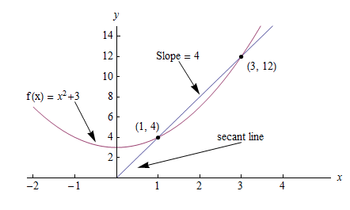

.. _calculus:

========
微积分
========

.. contents:: :local:

.. _introduction:

简介
============

你需要知道一下基本的微积分来理解函数是如何随时间改变的(导数), 并且计算随着时间累计的总量(积分)。微积分的语言可以让你更准确的描述函数的属性，更好的理解他们的行为。

通常上微积分课程需要进行很多的乏味的手工计算，但是我们的电脑可以让这个过程变得很有趣。这一节描述微积分的关键思路，这是你理解机器学习的必需掌握的。

.. _derivative:

导数
===========
导数可以用两种方式来定义:

 #. 某瞬间的变化率(物理)
 #. 一条线上的某点的斜率(几何)

他们都表示了相同的原理， 但是用几何的定义解释会容易一些。

几何定义
--------------------

几何斜率代表一条线的陡峭程度。它回答了一个问题: 给定某个 :math:`x` 的变化， :math:`y` 或 :math:`f(x)` 会产生多大变化。

.. image:: images/slope_formula.png
    :align: center

使用这个定义我们可以很容易的计算2点之间的斜率。但是如果我问你，不是计算2点之间的斜率，而是计算线上一个点的斜率呢？这种情况下就没那么简单的计算了。导数可以帮助我们回答这个问题。

导数输出一个表达式我们可以用来计算 *某瞬间的变化率* 或一条线上某点的斜率。解出导数你就可以计算线上其他点的斜率。

求导
---------------------

如下图所示, 函数 :math:`f(x) = x^2 + 3`.

(1,4) 和 (3,12) 2点间的斜率是:

.. math::

  slope = \frac{y2-y1}{x2-x1} = \frac{12-4}{3-1} = 4

但是如何计算点(1,4)的斜率？

一种方法是找2个最近的点，技术它们相对 :math:`x` 的斜率然后求平均。但是微积分提供了一张更简单更准确的方法:计算导数。计算函数的导数和我们原来的提议是一样的，
但是我们不找2个最近的点，而是想象一个距离 :math:`x` 无穷近的点然后计算 :math:`x` 和这个点之间的斜率。

这样的话，导数帮助我们回答这个问题: 如果我们把x很小很小地增加一点，:math:`f(x)` 会变化多少?
换句话说，导数帮助 *估计* 2个无穷距离小的点之间的斜率。很小很小的距离，但是足以计算斜率就行。

在数学语言里我们用极限表示无穷小的增长。极限的定义是，当输入趋近于一个值时，函数的输出趋近的值。在我们的例子里，目标值就是某个点的斜率。

步骤
------------

计算导数和计算普通斜率一样，只是我们计算一个点和距离它无穷小的点的斜率。我们使用变量 :math:`h` 来表示这个无穷小的距离。这个是我们的步骤:

1. 给定一个函数:

.. math::

  f(x) = x^2

2. 增加 :math:`x` 一个很小的值 :math:`h (h = Δx)`

.. math::

  f(x + h) = (x + h)^2

3. 使用斜率公式

.. math::

  \frac{f(x + h) - f(x)}{h}

4. 简化这个等式

.. math::

  \frac{x^2 + 2xh + h^2 - x^2}{h} \\

  \frac{2xh+h^2}{h} = 2x+h

5. 把 :math:`h` 设为 0 (极限是 :math:`h` 趋近 0)

.. math::

  {2x + 0} = {2x}

这意味着什么？这意味着对于函数 :math:`f(x) = x^2` , 任意点的斜率等于 :math:`2x` 。公式定义为:

.. math::

  \lim_{h\to0}\frac{f(x+h) - f(x)}{h}

.. rubric:: Code

让我们写代码来计算任意函数 :math:`f(x)` 的导数。我们可以通过测试输入 :math:`f(x)=x^2` 会产生导数 :math:`2x` 来验证我们的函数正常工作。

::

  def get_derivative(func, x):
      """Compute the derivative of `func` at the location `x`."""
      h = 0.0001                          # step size
      return (func(x+h) - func(x)) / h    # rise-over-run

  def f(x): return x**2                   # some test function f(x)=x^2
  x = 3                                   # the location of interest
  computed = get_derivative(f, x)
  actual = 2*x

  computed, actual   # = 6.0001, 6        # pretty close if you ask me...

通常我们希望使用数学来获得准确的导数公式，但是记住你永远可以通过计算一个很小的 :math:`h` 来计算导数值。

机器学习用例
--------------------------

机器学习使用导数进行问题优化。优化算法如 *梯度下降* 使用导数来决定是否增加或减少权重来最大化或最小化一下目标值(如. 模型的准确率或错误函数)。
导数还能帮助我们把非线性函数近似为线性函数(切线), 线性函数的斜率是一个常数。有了常数斜率我们可以决定上升还是下假斜率（增加和减少权重）来接近目标值(分类标签)。

.. _chain_rule:

链式法则
==========

链式法则是一个计算组合函数的导数的公式。组合函数是在内部组合其他函数的函数。

如何工作的
------------

跟定一个组合函数 :math:`f(x) = A(B(x))`, :math:`f(x)` 的导数等于 :math:`A` 相对 :math:`B(x)` 的导数乘以 :math:`B` 相对 :math:`x` 的导数。

.. math::

  \mbox{组合函数导数} = \mbox{外部函数导数} * \mbox{内部函数导数}

例如，给定组合函数 :math:`f(x)`, 当

.. math::

  f(x) = h(g(x))

链式法则告诉我们 :math:`f(x)` 的导数等于:

.. math::

  \frac{df}{dx} = \frac{dh}{dg} \cdot \frac{dg}{dx}

详细步骤
------------

假设 :math:`f(x)` 是 :math:`h(x) = x^3` 和 :math:`g(x) = x^2` 2个函数的组合。那么

.. math::

  \begin{align}
  f(x) &= h(g(x)) \\
       &= (x^2)^3 \\
  \end{align}

:math:`f(x)` 的导数等于:

.. math::

  \begin{align}
  \frac{df}{dx} &=  \frac{dh}{dg} \frac{dg}{dx} \\
                &=  \frac{dh}{d(x^2)} \frac{dg}{dx}
  \end{align}

.. rubric:: 步骤

1. 算出内部导数 :math:`g(x) = x^2`

.. math::

  \frac{dg}{dx} = 2x

2. 算出外部导数 :math:`h(x) = x^3`, 使用占位符 :math:`b` 表示内部函数 :math:`x^2`

.. math::

  \frac{dh}{db} = 3b^2

3. 用内部函数替换占位符

.. math::

  3x^4

4. 返回2个导数乘积

.. math::

  3x^4 \cdot 2x = 6x^5
