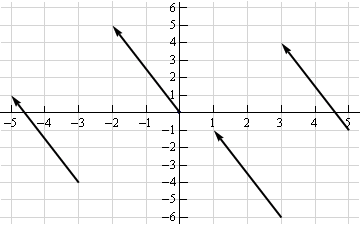
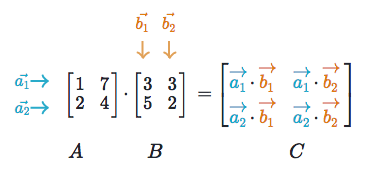

.. _linear_algebra:

==============
线性代数
==============

.. contents:: :local:

线性代数是一个数学工具帮助我们同时处理一组数字。
它提供了向量和矩阵(电子表格)这样的结构来存放这些数字，还有一些加减乘除的新的规则。
这里是线性代数一个简单概览 `post <https://medium.com/p/cd67aba4526c>`_.

向量
=======

向量是数字或(代数等式中的)项的一维数组。在几何中，向量存储一个潜在的变化的大小和方向。向量[3, -2] 表示向右为3向下为2。多于一维的向量成为矩阵。

符号
--------
有一些不同的向量表示方法。这里是一些阅读时我们会碰到的。

.. math::

  v = \begin{bmatrix}
  1 \\
  2 \\
  3 \\
  \end{bmatrix}
  =
  \begin{pmatrix}
  1 \\
  2 \\
  3 \\
  \end{pmatrix}
  =
  \begin{bmatrix}
  1 & 2 & 3\\
  \end{bmatrix}

几何中的向量
-------------------

向量通常表示从一个点的运动。它们存储了潜在移动的大小和方向。向量[-2,5]表示向左2个单位，向上5个单位的移动 [1]_。

向量可以被运用到空间中的任意点。这个向量的方向等于斜边的斜率。它的大小等于斜边的长度。

标量运算
-----------------
标量运算包含一个向量和一个数字。你可以通过加减乘以这个数字来修改一个向量中的所有值。

.. math::

  \begin{bmatrix}
  2 \\
  2 \\
  2 \\
  \end{bmatrix}
  +
  1
  =
  \begin{bmatrix}
  3 \\
  3 \\
  3 \\
  \end{bmatrix}

元素运算
----------------------

在元素运算如加，减，除，值的位置保持不变成为新的向量。向量A的第一个值对应向量B的第一个值，第二个值对应第二个值，以此类推。
这意味着完成运算后向量应该有相同的维度。*

.. math::

  \begin{bmatrix}
  a_1 \\
  a_2 \\
  \end{bmatrix}
  +
  \begin{bmatrix}
  b_1 \\
  b_2 \\
  \end{bmatrix}
  =
  \begin{bmatrix}
  a_1+b_1 \\
  a_2+b_2 \\
  \end{bmatrix}

::

  y = np.array([1,2,3])
  x = np.array([2,3,4])
  y + x = [3, 5, 7]
  y - x = [-1, -1, -1]
  y / x = [.5, .67, .75]

在下面查看numpy里broadcasting的详情。

点积
-----------

2个向量点积是一个矢量。向量和矩阵的点积是深度学习中最重要的运算。

.. math::

  \begin{bmatrix}
  a_1 \\
  a_2 \\
  \end{bmatrix}
  \cdot
  \begin{bmatrix}
  b_1 \\
  b_2 \\
  \end{bmatrix}
  = a_1 b_1+a_2 b_2

::

  y = np.array([1,2,3])
  x = np.array([2,3,4])
  np.dot(y,x) = 20

Hadamard 乘积
----------------
Hadamard 乘积是一个元素乘积，输出一个向量.

.. math::

  \begin{bmatrix}
  a_1 \\
  a_2 \\
  \end{bmatrix}
   \odot
  \begin{bmatrix}
  b_1 \\
  b_2 \\
  \end{bmatrix}
  =
  \begin{bmatrix}
  a_1 \cdot b_1 \\
  a_2 \cdot b_2 \\
  \end{bmatrix}

::

  y = np.array([1,2,3])
  x = np.array([2,3,4])
  y * x = [2, 6, 12]

向量场
-------------

向量场显示如果我们给点(x,y)应用一个向量函数如加或乘，它会移动多远。给定空间的一个点，向量场表示图中不同点移动的方向和力。[2]_.

.. image:: images/vector_field.png
    :align: center

向量场有趣的是不同的移动方向依赖于开始的点。原因是场中的向量存储这(代数等式中的)项如 :math:`2x` 或 :math:`x^2` 而不是标量如-2和5。
对图中任意的点，我们在x轴上加上 :math:`2x`  或 :math:`x^2` 然后从那个起始点画一个箭头到新的位置。向量场在可视化机器学习的技术如梯度下降上非常有用。

矩阵
========

矩阵是一个包含数字或项的矩形的表格(如Excel spreadsheet) 和一些加减乘除的特殊规则。

维度
----------
我们把矩阵的维度描述为行和列。

.. math::

  \begin{bmatrix}
  2 & 4 \\
  5 & -7 \\
  12 & 5 \\
  \end{bmatrix}
  \begin{bmatrix}
  a² & 2a & 8\\
  18 & 7a-4 & 10\\
  \end{bmatrix}

第一个维度为 (3,2). 第二个 (2,3).

::

  a = np.array([
   [1,2,3],
   [4,5,6]
  ])
  a.shape == (2,3)
  b = np.array([
   [1,2,3]
  ])
  b.shape == (1,3)

标量运算
-----------------

矩阵的标量运算和向量一样。简单的给每个元素应用标量进行加减乘除即可。

.. math::

  \begin{bmatrix}
  2 & 3 \\
  2 & 3 \\
  2 & 3 \\
  \end{bmatrix}
  +
  1
  =
  \begin{bmatrix}
  3 & 4 \\
  3 & 4 \\
  3 & 4 \\
  \end{bmatrix}

::

  # Addition
  a = np.array(
  [[1,2],
   [3,4]])
  a + 1
  [[2,3],
   [4,5]]

元素运算
----------------------

2个矩阵进行加，减，除必须有相同的维度。我们组合逐个元素的方式产生新的矩阵。

.. math::

  \begin{bmatrix}
  a & b \\
  c & d \\
  \end{bmatrix}
  +
  \begin{bmatrix}
  1 & 2\\
  3 & 4 \\
  \end{bmatrix}
  =
  \begin{bmatrix}
  a+1 & b+2\\
  c+3 & d+4 \\
  \end{bmatrix}

::

  a = np.array([
   [1,2],
   [3,4]])
  b = np.array([
   [1,2],
   [3,4]])

  a + b
  [[2, 4],
   [6, 8]]

  a — b
  [[0, 0],
   [0, 0]]

Hadamard 乘积
----------------
Hadamard 乘积 of matrices is an elementwise operation.
矩阵的Hadamard 乘积是一个元素运算。位置对应的元素相乘产生新的矩阵。

.. math::

  \begin{bmatrix}
  a_1 & a_2 \\
  a_3 & a_4 \\
  \end{bmatrix}
  \odot
  \begin{bmatrix}
  b_1 & b_2 \\
  b_3 & b_4 \\
  \end{bmatrix}
  =
  \begin{bmatrix}
  a_1 \cdot b_1 & a_2 \cdot b_2 \\
  a_3 \cdot b_3 & a_4 \cdot b_4 \\
  \end{bmatrix}

::

  a = np.array(
  [[2,3],
   [2,3]])
  b = np.array(
  [[3,4],
   [5,6]])

  # Uses python's multiply operator
  a * b
  [[ 6, 12],
   [10, 18]]

在numpy中，你可以把矩阵和向量进行Hadamard乘积，只要他们的维度满足broadcasting的需求。

.. math::

  \begin{bmatrix}
  {a_1} \\
  {a_2} \\
  \end{bmatrix}
  \odot
  \begin{bmatrix}
  b_1 & b_2 \\
  b_3 & b_4 \\
  \end{bmatrix}
  =
  \begin{bmatrix}
  a_1 \cdot b_1 & a_1 \cdot b_2 \\
  a_2 \cdot b_3 & a_2 \cdot b_4 \\
  \end{bmatrix}

矩阵的转置
----------------

神经网络经常处理不同大小的输入，它们的维度不满足矩阵相乘的需求。
矩阵转置提供一个『旋转』矩阵的方法，从而让乘法操作可行。矩阵的转置分为2步：

  1. 把矩阵向右旋转 90°

  2. 反转每行的元素顺序 (例如 [a b c] 变成 [c b a])

例子，把矩阵 M 转置为 T:

.. math::

  \begin{bmatrix}
  a & b \\
  c & d \\
  e & f \\
  \end{bmatrix}
  \quad \Rightarrow \quad
  \begin{bmatrix}
  a & c & e \\
  b & d & f \\
  \end{bmatrix}

::

  a = np.array([
     [1, 2],
     [3, 4]])

  a.T
  [[1, 3],
   [2, 4]]

矩阵乘法
---------------------

矩阵乘法规定一组把2个矩阵相乘产生新的矩阵的规则。

**规则**

不是所有的矩阵都可以相乘。而且输出的矩阵维度取决于源矩阵。

  1. 第一个矩阵的列数必须和第二个矩阵的行数相等

  2. M x N 矩阵乘以 N x K 矩阵结果为 M x K 的矩阵, 新的矩阵行数为第一个矩阵的行数，列数为第二个矩阵的列数。

**步骤**

矩阵乘法依赖点积来吧不同的行和列乘起来。
如下图，来自Khan Academy的线性代数课程，矩阵C的每个项是矩阵A的行和矩阵B的列的点积。[3]_

运算a1 · b1 表示我们取矩阵A 第一行(1, 7)和 矩阵B第一列的点积。

.. math::

  a_1 \cdot b_1 =
  \begin{bmatrix}
  1 \\
  7 \\
  \end{bmatrix}
  \cdot
  \begin{bmatrix}
  3 \\
  5 \\
  \end{bmatrix}
  = (1 \cdot 3) + (7 \cdot 5) = 38

另外一个方式理解:

.. math::

  \begin{bmatrix}
  a & b \\
  c & d \\
  e & f \\
  \end{bmatrix}
  \cdot
  \begin{bmatrix}
  1 & 2 \\
  3 & 4 \\
  \end{bmatrix}
  =
  \begin{bmatrix}
  1a + 3b & 2a + 4b \\
  1c + 3d & 2c + 4d \\
  1e + 3f & 2e + 4f \\
  \end{bmatrix}

自我测试
-------------

1. 相乘后的维度是多少?

.. math::

  \begin{bmatrix}
  1 & 2 \\
  5 & 6 \\
  \end{bmatrix}
  \cdot
  \begin{bmatrix}
  1 & 2 & 3 \\
  5 & 6 & 7 \\
  \end{bmatrix}
  = \text{2 x 3}

2. 相乘后的维度是多少?

.. math::

  \begin{bmatrix}
  1 & 2 & 3 & 4 \\
  5 & 6 & 7 & 8 \\
  9 & 10 & 11 & 12 \\
  \end{bmatrix}
  \cdot
  \begin{bmatrix}
  1 & 2 \\
  5 & 6 \\
  3 & 0 \\
  2 & 1 \\
  \end{bmatrix}
  = \text{3 x 2}

3. 相乘后的矩阵?

.. math::

  \begin{bmatrix}
  2 & 3 \\
  1 & 4 \\
  \end{bmatrix}
  \cdot
  \begin{bmatrix}
  5 & 4 \\
  3 & 5 \\
  \end{bmatrix}
  =
  \begin{bmatrix}
  19 & 23 \\
  17 & 24 \\
  \end{bmatrix}

4. 相乘后的矩阵是?}

.. math::

  \begin{bmatrix}
  3 \\
  5 \\
  \end{bmatrix}
  \cdot
  \begin{bmatrix}
  1 & 2 & 3\\
  \end{bmatrix}
  =
  \begin{bmatrix}
  3 & 6 & 9 \\
  5 & 10 & 15 \\
  \end{bmatrix}

5. 相乘后的矩阵是?

.. math::

  \begin{bmatrix}
  1 & 2 & 3\\
  \end{bmatrix}
  \cdot
  \begin{bmatrix}
  4 \\
  5 \\
  6 \\
  \end{bmatrix}
  =
  \begin{bmatrix}
  32 \\
  \end{bmatrix}

Numpy
=====

点积
-----------

Numpy使用函数np.dot(A,B) 进行向量和矩阵的乘法。
有一下有趣的特性和坑，建议你在使用前阅读文档。

::

  a = np.array([
   [1, 2]
   ])
  a.shape == (1,2)
  b = np.array([
   [3, 4],
   [5, 6]
   ])
  b.shape == (2,2)

  # Multiply
  mm = np.dot(a,b)
  mm == [13, 16]
  mm.shape == (1,2)

Broadcasting
------------

在numpy中， 维度的要求在逐元素的操作会使用一个叫做broadcasting的机制自动满足。
2个矩阵可以兼容,如果(行对行，列对列)满足下面的条件:

  1. 维度相同, or

  2. 一个维度是 1

::

  a = np.array([
   [1],
   [2]
  ])
  b = np.array([
   [3,4],
   [5,6]
  ])
  c = np.array([
   [1,2]
  ])

  # Same no. of rows
  # Different no. of columns
  # but a has one column so this works
  a * b
  [[ 3, 4],
   [10, 12]]

  # Same no. of columns
  # Different no. of rows
  # but c has one row so this works
  b * c
  [[ 3, 8],
   [5, 12]]

  # Different no. of columns
  # Different no. of rows
  # but both a and c meet the
  # size 1 requirement rule
  a + c
  [[2, 3],
   [3, 4]]

.. rubric:: Tutorials

- `Khan Academy Linear Algebra <https://medium.com/r/?url=https%3A%2F%2Fwww.khanacademy.org%2Fmath%2Flinear-algebra>`_

- `Deep Learning Book Math <https://medium.com/r/?url=http%3A%2F%2Fwww.deeplearningbook.org%2Fcontents%2Fpart_basics.html>`_

- `Andrew Ng Course Notes <https://medium.com/r/?url=https%3A%2F%2Fwww.coursera.org%2Flearn%2Fmachine-learning%2Fresources%2FJXWWS>`_

- `Linear Algebra Better Explained <https://medium.com/r/?url=https%3A%2F%2Fbetterexplained.com%2Farticles%2Flinear-algebra-guide%2F>`_

- `Understanding Matrices Intuitively <https://medium.com/r/?url=http%3A%2F%2Fblog.stata.com%2F2011%2F03%2F03%2Funderstanding-matrices-intuitively-part-1%2F>`_

- `Intro To Linear Algebra <https://medium.com/r/?url=http%3A%2F%2Fwww.holehouse.org%2Fmlclass%2F03_Linear_algebra_review.html>`_

- `Immersive Math <https://medium.com/r/?url=http%3A%2F%2Fimmersivemath.com%2Fila%2Findex.html>`_

.. rubric:: References

.. [1] http://mathinsight.org/vector_introduction
.. [2] https://en.wikipedia.org/wiki/Vector_field
.. [3] https://www.khanacademy.org/math/precalculus/precalc-matrices/properties-of-matrix-multiplication/a/properties-of-matrix-multiplication
